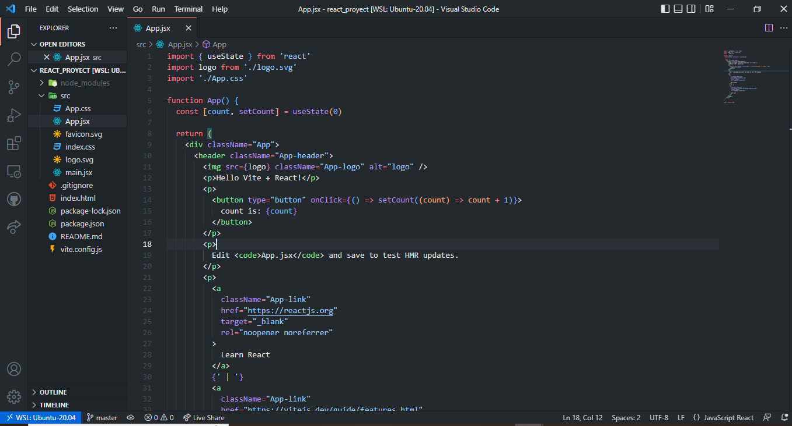
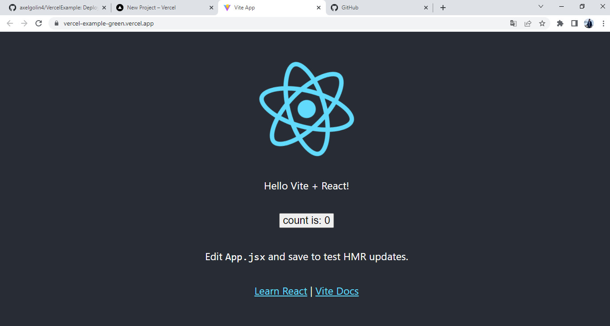
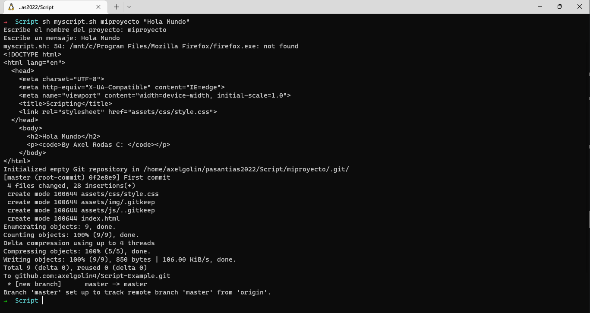
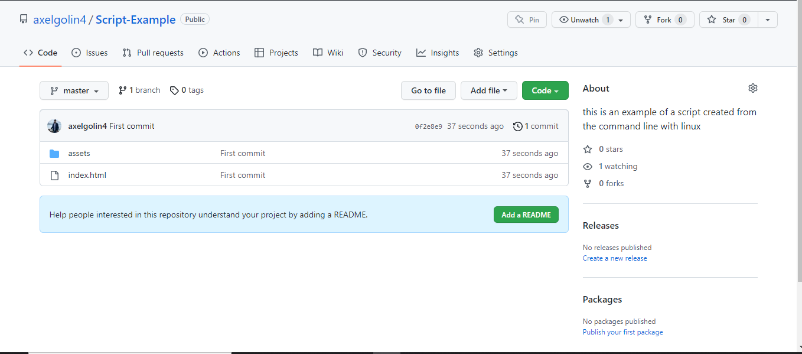
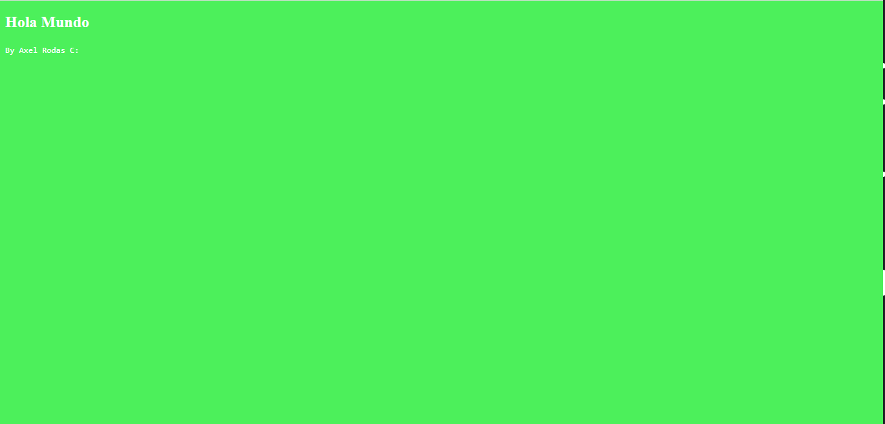

# Primer dia de pasantia

Configuramos nuestro entorno de trabajo 
Intalando extenciones en VS y configurando WSL

Se hizo un deploy en versel de una pagina creada con el framework de react

# Segundo dia de pasantia

## Activida de creacion Script con Bash 
Se Creo un script desde la terminal de ubuntu.
Donde se creara un archivo html y un css y se guardaran en carperas.
luego se  hiciera un commit con esos archivos y hacer un push
al repositorio remoto de git.

luego se abriera el navegador mostrando la pagina creada.

### Script ejecutado. 

### Repositorio de git remoto.

### Mensaje en el navegador web.
