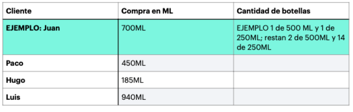

# Lógica general 
1. Describa brevemente como resolvería el siguiente problema en un programa de 
computadora. (Únicamente la descripción de qué es lo que haría usted, no lo 
programe). Sea lo más especifico posible.

En una tienda de productos de limpieza se venden detergentes líquidos por ML, y se 
tienen botellas de 100ML, 250ML, 350ML, 500ML. Hay cierta existencia de cada una de 
las botellas. 

| CAPACIDAD   | CANTIDAD  |
| ----------- | --------- |
|   100ML     |          7|
|   250ML     |         15|
|   350ML     |          5|
|   500ML     |          3|

1. ¿Qué haría usted para que cuando un cliente compre algún producto se utilicen 
la menor cantidad de botellas, y se desperdicie la menor cantidad de espacio en 
las mismas.?


2. Plasme la descripción de su algoritmo.


3. Ejemplifique cómo distribuiría el liquido en los contenedores de la tabla de arriba 
con las siguientes compras ficticias, siguiendo su propuesta.


## SOLUCION

Ordenaria las botelllas de mayor a menor y trataria de vender las botellas de mayor cantidad primero.
si el usiario desea una cantidad menor a la mas grande, buscaria una botella mas pequeña hasta encontrar la adecuada.


1.Pedir la cantidad deseada por el cliente de Bebida.

2.restar 500ML a la cantidad ingresada 

3.si la cantidad del liquido requerido por el cliente aun es mayor a 500 repetir el paso 2 si la cantidad del cliente es menor o igual a 0 finalizar.

4.restar 350ML a la cantidad ingresada 

5.si la cantidad del liquido requerido por el cliente aun es mayor a 350ML repetir el paso 4 si la cantidad del cliente es menor o igual a 0 finalizar.

6.restar 250ML a la cantidad ingresada

7.si la cantidad del liquido requerido por el cliente aun es mayor a 250ML repetir el paso 6 si la cantidad del cliente es menor o igual a 0 finalizar.

8.restar 100ML a la cantidad ingresada 

9.si la cantidad del liquido requerido por el cliente aun es mayor a 100ML repetir el paso 8 si la cantidad del cliente es menor o igual a 0 finalizar.

10.Fin

| Cliente    | Compra    | Cantidad de botellas       |
| -----------| --------- | ---------------------------|     
|   Juan     |      700ML|  1 de 500ML y 1 de 250ML   |                      
|   Paco     |      400ML|  1 de 350ML y 1 de 100ML   |                        
|   Hugo     |      185ML|  2 de 100ML o 1 de 100ML   |                       
|   Luis     |      940ML|  1 de 500ML y 1 de 350 o 1 de 500ML y 1 de 250 ML|





2. 👩‍💻 estás trabajando en un sistema operativo para ser usado en el taller de Santa Claus 🎅.

    Se ha dado cuenta que en el taller nadie le presta atención a los nombres de los ficheros y a veces intentan guardar el mismo fichero más de una vez... así que es importante que gestionemos bien los nombres duplicados.

    Tenemos que crear una función que al pasarnos un array de nombres de archivo devolvamos un array con el mismo número de elementos pero donde los nombres que se repetían se anexe al final (k) donde k sería el número de veces que se encontró repetido.

    Lo mejor es que veamos un ejemplo:

```python
files = ['photo', 'postcard', 'photo', 'photo', 'video']
fixFiles(files) # ['photo', 'postcard', 'photo(1)', 'photo(2)', 'video']
files2 = ['file', 'file', 'file', 'game', 'game']
fixFiles(files2) = ['file', 'file(1)', 'file(2)', 'game', 'game(1)']
# ojo que los elfos ya tenían archivos con (1)... ¡y pueden estar repetidos!
files3 = ['file', 'file(1)', 'icon', 'icon(1)', 'icon(1)']
fixFiles(files3) # ['file', 'file(1)', 'icon', 'icon(1)', 'icon(1)(1)']
```
   Se le pide realizar  el algoritmo para la implementacion la funcion descrita anteriormente.

## SOLUCION

1.Pedir el nombre del fichero

2.Recorrer la lista de nombres desde el principio.

3.Si el nombre es igual al nombre de la lista agregar al nombre (N) 'N empieza en 1'

4 Avanzar al siguiente nombre de lista 

5.Si el nombre es igual al nombre de la lista agregar al nombre (N + 1) 

6.Si no se ha finalizado de analizar la lista regresar al paso 4

7.Si el nombre no esta repetido en la lista que se guarde con su nombre original (saltar a paso 9)

8.si el nombre esta repetido que se guarde por su nombre + (N)

9.Fin
