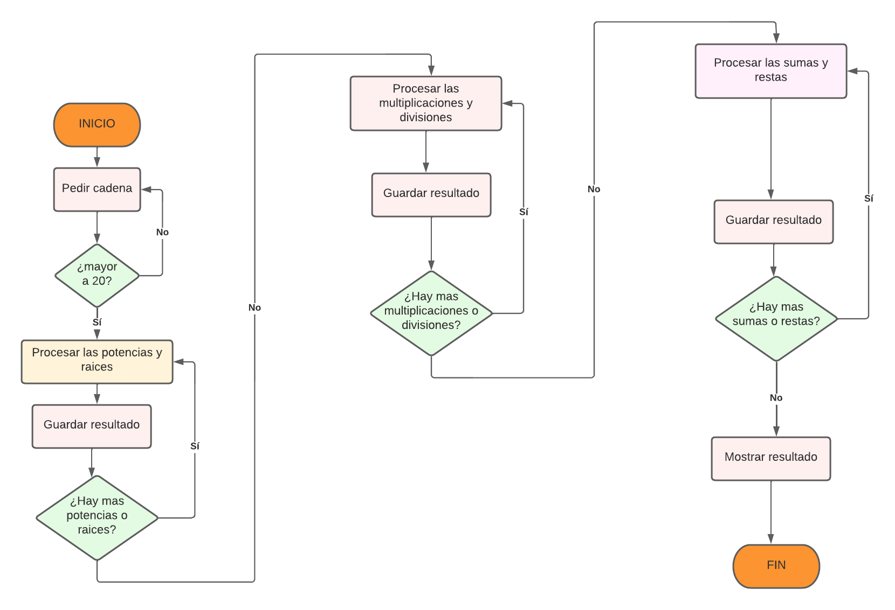
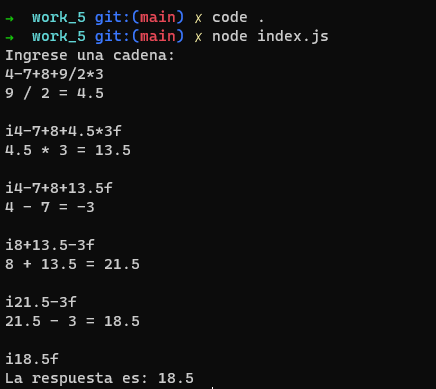
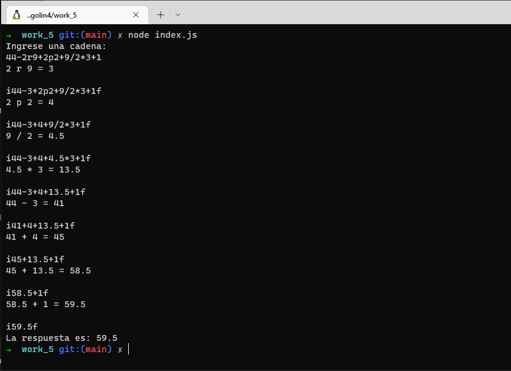

# CALCULADORA EN JS

Nos piden realizar  una calculadora de operaciones básicas que resuelva las operaciones dada una cadena.

Tener en cuenta:
- Deberá realizar las 4 operaciones básicas en la misma cadena suma +, resta -, 
Multiplicación *, División / 
- La longitud maxima a ingresar de la cadena serán 20 caracteres.
- Se deberán respetar la prioridad de los operadores.
- * Punto extra si se utilizan paréntesis para agrupamiento y multiplicación 
- * Punto Extra si se realiza potencia o raíz cuadrada
- Queda prohibido utilizar la función EVAL o equivalentes, o en su defecto incluir 
alguna librería que realice todo el proceso. (Recuerde que la finalidad de esto es 
evaluar la lógica de programación).

## SOLUCION PROPUESTA

DEBEMOS VERIFICAR SI LA CADENA INGRESADA ES MAYOR A 20 SI ES MAYOR DEBEREMOS MOSTRAR UN MENSAJE DE ERROS
SI LA CADENA ES MENOR DEBERA SEGUIR SIENDO PROCESADA.
PRIMERO DEBEMOS BUSCAR LAS POTENCIAS Y RAICES EN LA CADENA, PROCESARLAS Y GUARDAR LOS RESULTADOS
LUEGO DEBEMOS BUSCAR LAS MULTIPLICACIONES Y DIVISIONES EN LA CADENA ESTAS TAMBIEN SE DEBEN DE 
PROCESAR Y GUARDAR EL RESULTADO Y POR ULTIMO DEJAMOS LAS SUMAS Y RESTAS, SE PROCESAN, GUARDAN EL 
RESULTADO Y LUEGO TENEMOS NUESTRO RESULTADO FINAL EL QUE SERA MOSTRADO.

## ALGORITMO

1. PEDIR UNA CADENA

2. VERIFICAR SI ES MAYOR A 20 CARACTERES 

3. VERIFICAR SI LA CADENA TIENE POTENCIAS O RAICES

4. REALIZAR LA OPERACION Y LUEGO REMPLAZAR EL RESULTADO POR LA OPERACION

5. SI LA CADENA YA NO TIENE RAICES O POTENCIAS CONTINUAR SI NO REGRESAR AL PASO 2

6. VERIFICAR SI LA CADENA TIENE MULTIPLICACIONES O DIVISIONES

7. REALIZAR LA OPERACION Y LUEGO REMPLAZAR EL RESULTADO POR LA OPERACION

8. SI LA CADENA YA NO TIENE MULTIPLICACIONES O DIVISIONES CONTINUAR SI NO REGRESAR AL PASO 5

9. VERIFICAR SI LA CADENA TIENE SUMAS O RESTAS

10. REALIZAR LA OPERACION Y LUEGO REMPLAZAR EL RESULTADO POR LA OPERACION

11. SI LA CADENA YA NO TIENE SUMAS O RESTAS CONTINUAR SI NO REGRESAR AL PASO 2

12. GUARDAR EL RESULTADO OBTENIDO

## DIAGRAMA DE FLUJO

## CAPURAS DE MI PROGRAMA EJECUTADO 

### EJEMPLO 1

### EJEMPLO 2

